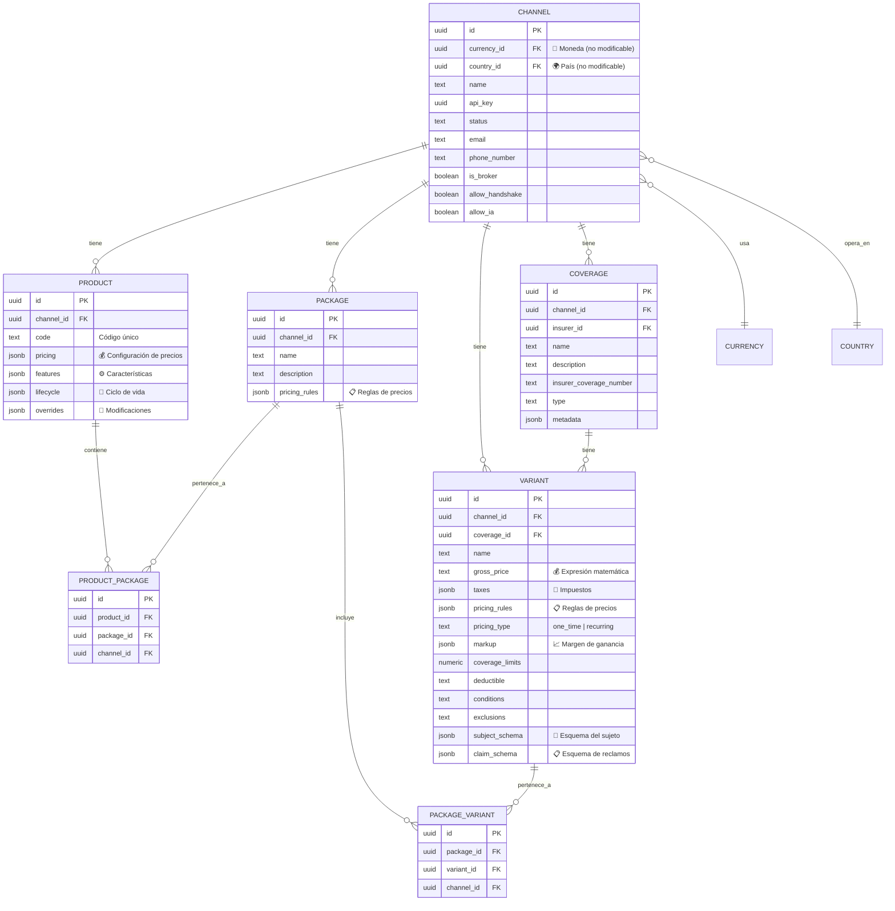
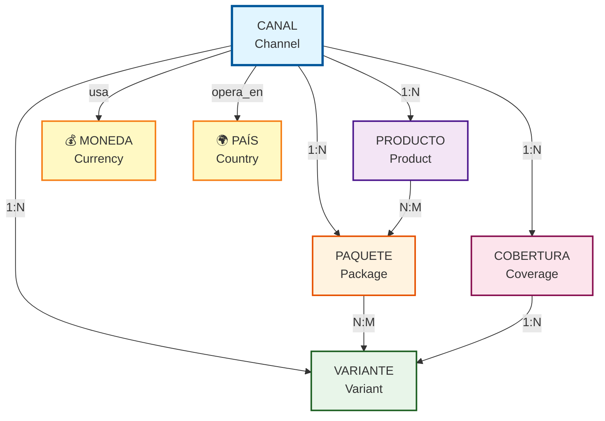
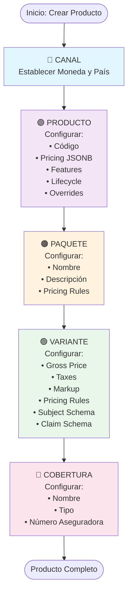
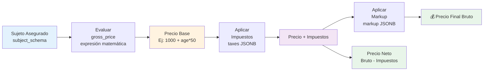
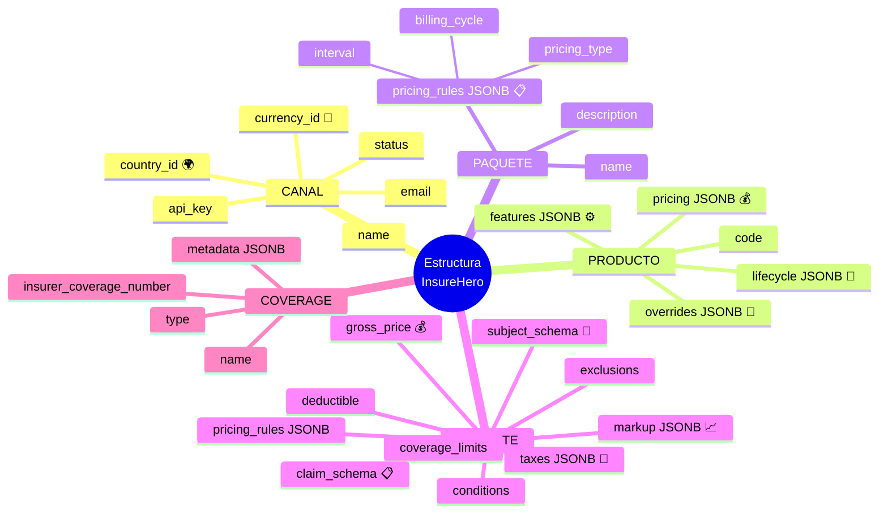

# Estructura Lógica de Productos: Canal → Producto → Paquete → Variante → Cobertura

Este documento explica la estructura jerárquica de productos en InsureHero, detallando qué se configura en cada nivel (precios, reglas, moneda).

import EstructuraJerarquica from '@site/src/components/EstructuraJerarquica';

## Vista General de la Estructura

<EstructuraJerarquica />

## Diagramas de Estructura

### Diagrama de Relaciones (Entity Relationship) - Vista Visual Interactiva

import DiagramaER from '@site/src/components/DiagramaER';

<DiagramaER />

### Diagrama de Relaciones (Entity Relationship) - Código Mermaid



### Diagrama de Jerarquía Visual - Vista Visual Interactiva

import DiagramaJerarquiaVisual from '@site/src/components/DiagramaJerarquiaVisual';

<DiagramaJerarquiaVisual />

### Diagrama de Jerarquía Visual - Código Mermaid



### Diagrama de Flujo de Configuración - Vista Visual Interactiva

import DiagramaFlujoConfiguracion from '@site/src/components/DiagramaFlujoConfiguracion';

<DiagramaFlujoConfiguracion />

### Diagrama de Flujo de Configuración - Código Mermaid



### Diagrama de Cálculo de Precios - Vista Visual Interactiva

import DiagramaCalculoPrecios from '@site/src/components/DiagramaCalculoPrecios';

<DiagramaCalculoPrecios />

### Diagrama de Cálculo de Precios - Código Mermaid



### Diagrama de Campos por Nivel - Vista Visual Interactiva

import DiagramaCamposPorNivel from '@site/src/components/DiagramaCamposPorNivel';

<DiagramaCamposPorNivel />

### Diagrama de Campos por Nivel - Código Mermaid



## Descripción Detallada por Nivel

### 1. CANAL (Channel)

El **Canal** es el nivel más alto de la jerarquía y representa una entidad que vende seguros a través de la plataforma InsureHero.

#### Configuración en este nivel:

- **Moneda (currency_id)**: 
  - La moneda base para todas las transacciones del canal
  - Se establece al crear el canal y **no puede modificarse** después
  - Referencia a la tabla `currencies`

- **País (country_id)**:
  - El país donde opera el canal
  - Se establece al crear el canal y **no puede modificarse** después
  - Referencia a la tabla `countries`

- **Configuración General**:
  - `name`: Nombre del canal
  - `api_key`: Clave API única para integraciones
  - `status`: Estado del canal (ACTIVE, INACTIVE)
  - `email`: Email del canal
  - `phone_number`: Número de teléfono
  - `is_broker`: Indica si el canal es un broker
  - `allow_handshake`: Permite handshake
  - `allow_ia`: Habilita agente de IA
  - Configuración de chatbot (opcional)

#### Tabla en Base de Datos:
```sql
CREATE TABLE "channels" (
    id uuid PRIMARY KEY,
    currency_id uuid NOT NULL,  -- Moneda del canal
    country_id uuid NOT NULL,   -- País del canal
    name text NOT NULL,
    api_key uuid NOT NULL,
    status text DEFAULT 'ACTIVE',
    -- ... otros campos
);
```

---

### 2. PRODUCTO (Product)

El **Producto** agrupa uno o más paquetes y define características generales del producto de seguro.

#### Configuración en este nivel:

- **Código del Producto (code)**:
  - Identificador único del producto dentro del canal

- **Precios (pricing - JSONB)**:
  - Configuración de precios a nivel de producto
  - Puede contener reglas de precios generales
  - Estructura flexible en formato JSON

- **Características (features - JSONB)**:
  - Características y funcionalidades del producto
  - Configuración de características especiales

- **Ciclo de Vida (lifecycle - JSONB)**:
  - Configuración del ciclo de vida del producto
  - Define estados y transiciones del producto

- **Modificaciones (overrides - JSONB)**:
  - Permite sobrescribir configuraciones heredadas
  - Personalización específica del producto

#### Tabla en Base de Datos:
```sql
CREATE TABLE "products" (
    id uuid PRIMARY KEY,
    channel_id uuid NOT NULL,
    code text NOT NULL,
    pricing jsonb NOT NULL,      -- Configuración de precios
    features jsonb NOT NULL,      -- Características
    lifecycle jsonb NOT NULL,     -- Ciclo de vida
    overrides jsonb NOT NULL,     -- Modificaciones
    -- ... otros campos
);
```

#### Relación con Paquetes:
- Un producto puede tener múltiples paquetes (relación N:M a través de `products_packages`)
- Un paquete puede pertenecer a múltiples productos

---

### 3. PAQUETE (Package)

El **Paquete** agrupa variantes relacionadas y define reglas de precios a nivel de paquete.

#### Configuración en este nivel:

- **Nombre (name)**:
  - Nombre descriptivo del paquete

- **Descripción (description)**:
  - Descripción detallada del paquete

- **Reglas de Precios (pricing_rules - JSONB)**:
  - **Tipo de precio (pricing_type)**:
    - `one_time`: Pago único
    - `recurring`: Pago recurrente
  - **Intervalo (interval)** (solo para recurring):
    - `day`: Diario
    - `week`: Semanal
    - `month`: Mensual
    - `year`: Anual
  - **Intervalo de conteo (interval_count)**:
    - Número de intervalos (ej: cada 2 meses)
  - **Ciclo de facturación (billing_cycle)**:
    - `start_of_month`: Inicio del mes
    - `end_of_month`: Fin del mes
    - `anniversary`: Aniversario
  - **Período de gracia (grace_period)** (opcional):
    - Días de gracia para pagos
  - **Período de prueba (trial_period)** (opcional):
    - Días de período de prueba

#### Tabla en Base de Datos:
```sql
CREATE TABLE "packages" (
    id uuid PRIMARY KEY,
    channel_id uuid NOT NULL,
    name text NOT NULL,
    description text,
    pricing_rules jsonb DEFAULT '{}',  -- Reglas de precios
    -- ... otros campos
);
```

#### Ejemplo de pricing_rules:
```json
{
  "pricing_type": "recurring",
  "interval": "month",
  "interval_count": "1",
  "billing_cycle": "start_of_month",
  "grace_period": "7",
  "trial_period": "30"
}
```

#### Relación con Variantes:
- Un paquete puede tener múltiples variantes (relación N:M a través de `packages_variants`)
- Una variante puede pertenecer a múltiples paquetes

---

### 4. VARIANTE (Variant)

La **Variante** es el nivel donde se define el precio específico y las condiciones detalladas de la cobertura.

#### Configuración en este nivel:

- **Nombre (name)**:
  - Nombre de la variante

- **Precio Bruto (gross_price)**:
  - Precio base de la variante
  - Puede ser una **expresión matemática** que se evalúa dinámicamente
  - Ejemplo: `"100 + (age * 2)"` donde `age` viene del `subject_schema`

- **Impuestos (taxes - JSONB)**:
  - Array de impuestos aplicables
  - Cada impuesto puede ser:
    - **Tipo rate**: Porcentaje sobre el precio bruto
    - **Tipo value**: Valor fijo
  - Ejemplo:
    ```json
    [
      {
        "name": "IVA",
        "rate": "0.16",
        "type": "rate"
      },
      {
        "name": "Tasa fija",
        "value": "50",
        "type": "value"
      }
    ]
    ```

- **Reglas de Precios (pricing_rules - JSONB)**:
  - Similar a las reglas del paquete, pero específicas de la variante
  - Pueden sobrescribir las reglas del paquete

- **Tipo de Precio (pricing_type)**:
  - `one_time` o `recurring`
  - Puede heredar del paquete o definirse específicamente

- **Markup (markup - JSONB)**:
  - Margen de ganancia adicional
  - Puede contener múltiples niveles de markup
  - Ejemplo:
    ```json
    [
      {
        "name": "Markup Canal",
        "gross_price": "50"
      }
    ]
    ```

- **Límites de Cobertura (coverage_limits)**:
  - Límite máximo de cobertura en valor numérico

- **Deducible (deductible)**:
  - Monto del deducible como texto (puede ser expresión)

- **Condiciones (conditions)**:
  - Texto descriptivo de las condiciones de la variante

- **Exclusiones (exclusions)**:
  - Texto descriptivo de las exclusiones

- **Esquema del Sujeto (subject_schema - JSONB)**:
  - Define los campos requeridos para el sujeto asegurado
  - Se usa para validar y calcular precios dinámicos
  - Ejemplo:
    ```json
    {
      "age": {
        "type": "number",
        "required": true,
        "label": "Edad"
      },
      "vehicle_value": {
        "type": "number",
        "required": true,
        "label": "Valor del vehículo"
      }
    }
    ```

- **Esquema de Reclamos (claim_schema - JSONB)**:
  - Define los campos requeridos para presentar un reclamo
  - Estructura similar a `subject_schema`

#### Tabla en Base de Datos:
```sql
CREATE TABLE "variants" (
    id uuid PRIMARY KEY,
    channel_id uuid NOT NULL,
    coverage_id uuid NOT NULL,      -- Relación con cobertura
    name text NOT NULL,
    gross_price text NOT NULL,       -- Expresión matemática
    taxes jsonb NOT NULL,            -- Array de impuestos
    pricing_rules jsonb,             -- Reglas de precios
    pricing_type text,               -- Tipo de precio
    markup jsonb NOT NULL,           -- Margen de ganancia
    coverage_limits numeric DEFAULT 0,
    deductible text,
    conditions text NOT NULL,
    exclusions text NOT NULL,
    subject_schema jsonb NOT NULL,   -- Esquema del sujeto
    claim_schema jsonb,              -- Esquema de reclamos
    -- ... otros campos
);
```

#### Cálculo de Precios:
El precio final se calcula:
1. Se evalúa `gross_price` usando los valores del `subject_schema`
2. Se aplican los impuestos (`taxes`)
3. Se aplica el markup (`markup`)
4. El precio neto = precio bruto - impuestos

---

### 5. COBERTURA (Coverage)

La **Cobertura** es el nivel más bajo y representa el tipo de seguro base proporcionado por una aseguradora.

#### Configuración en este nivel:

- **Nombre (name)**:
  - Nombre de la cobertura

- **Descripción (description)**:
  - Descripción detallada de la cobertura

- **Número de Cobertura del Asegurador (insurer_coverage_number)**:
  - Identificador de la cobertura en el sistema de la aseguradora

- **Tipo (type)**:
  - Tipo de cobertura (ej: "Vida", "Salud", "Auto", etc.)

- **Metadatos (metadata - JSONB)**:
  - Información adicional flexible en formato JSON

#### Tabla en Base de Datos:
```sql
CREATE TABLE "coverages" (
    id uuid PRIMARY KEY,
    channel_id uuid NOT NULL,
    insurer_id uuid,                -- Relación con aseguradora
    name text NOT NULL,
    description text,
    insurer_coverage_number text NOT NULL,
    type text,
    metadata jsonb DEFAULT '{}',
    -- ... otros campos
);
```

#### Relación con Variantes:
- Una cobertura puede tener múltiples variantes (1:N)
- Cada variante pertenece a una única cobertura

---

## Flujo de Configuración de Precios

### Herencia y Precedencia

1. **Moneda**: Se establece a nivel de **Canal** y se aplica a todos los niveles inferiores
2. **Reglas de Precio**: 
   - Se pueden definir en **Paquete** y **Variante**
   - Las reglas de **Variante** tienen precedencia sobre las de **Paquete**
3. **Precio Base**: Se define en **Variante** (`gross_price`)
4. **Impuestos**: Se aplican en **Variante** sobre el precio bruto
5. **Markup**: Se aplica en **Variante** después de impuestos

### Ejemplo de Cálculo de Precio Final

```
Canal: Moneda = USD

Variante:
  - gross_price = "1000 + (age * 50)"
  - taxes = [{"rate": "0.16", "type": "rate"}]
  - markup = [{"gross_price": "100"}]

Sujeto asegurado: age = 30

Cálculo:
  1. Precio base = 1000 + (30 * 50) = 2500 USD
  2. Impuesto (16%) = 2500 * 0.16 = 400 USD
  3. Precio con impuesto = 2500 + 400 = 2900 USD
  4. Markup = 100 USD
  5. Precio final bruto = 2900 + 100 = 3000 USD
  6. Precio neto = 3000 - 400 = 2600 USD
```

---

## Resumen de Configuraciones por Nivel

| Nivel | Moneda | Precios | Reglas | Esquemas | Otros |
|-------|--------|---------|--------|----------|-------|
| **Canal** | ✅ (currency_id) | ❌ | ❌ | ❌ | País, API Key, Configuración general |
| **Producto** | ❌ (hereda) | ✅ (pricing JSONB) | ❌ | ❌ | Código, Features, Lifecycle, Overrides |
| **Paquete** | ❌ (hereda) | ❌ | ✅ (pricing_rules JSONB) | ❌ | Nombre, Descripción |
| **Variante** | ❌ (hereda) | ✅ (gross_price, taxes, markup) | ✅ (pricing_rules JSONB) | ✅ (subject_schema, claim_schema) | Límites, Deducible, Condiciones, Exclusiones |
| **Cobertura** | ❌ (hereda) | ❌ | ❌ | ❌ | Nombre, Tipo, Número de aseguradora |

---

## Notas Importantes

1. **Moneda**: Una vez establecida en el Canal, **no puede modificarse**. Esto asegura consistencia en todas las transacciones.

2. **Expresiones Matemáticas**: El `gross_price` en Variantes puede usar expresiones que se evalúan dinámicamente usando valores del `subject_schema`.

3. **Relaciones N:M**: 
   - Productos ↔ Paquetes (a través de `products_packages`)
   - Paquetes ↔ Variantes (a través de `packages_variants`)

4. **Validaciones**:
   - Los UIDs deben ser únicos dentro del mismo canal
   - Los esquemas (`subject_schema`, `claim_schema`) tienen palabras reservadas que no pueden usarse

5. **Soft Delete**: Todas las tablas principales tienen `deleted_at` para implementar eliminación lógica.

---

## Referencias en el Código

- **Migración de Base de Datos**: `apps/next/supabase/migrations/20250204211512_remote_schema.sql`
- **Validaciones**: `apps/next/src/validations/`
- **Routers TRPC**: `apps/next/src/trpc/`
- **Utilidades de Paquetes**: `apps/next/src/utils/package.utils.ts`
- **Cálculo de Precios**: `apps/next/src/utils/processPayment.utils.ts`
