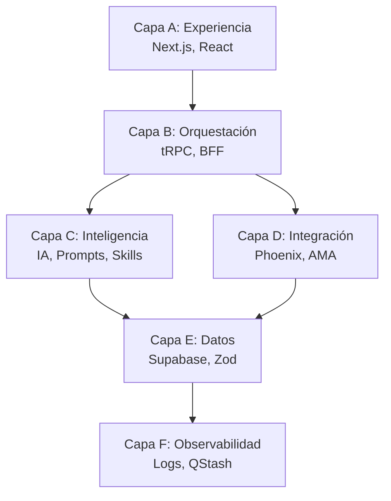

# Arquitectura de 6 Capas (Framework A-F)

La arquitectura del monorepo se organiza en **seis capas operativas** para separar responsabilidades y asegurar la escalabilidad. Toda lógica generada por IA debe ubicarse en la capa correcta según su responsabilidad.

## Las 6 capas

| Capa | Nombre | Responsabilidad |
|------|--------|-----------------|
| **A** | Experiencia | Interfaz de usuario (Next.js, React). Sin lógica de base de datos directa. |
| **B** | Orquestación | Lógica de negocio y BFF (tRPC, Workflows). |
| **C** | Inteligencia | Motores de IA, Prompts y Skills del Agente. |
| **D** | Integración | Adaptadores de carriers externos (Phoenix, AMA). |
| **E** | Datos | Persistencia, RLS de Supabase y validaciones Zod. |
| **F** | Observabilidad | Logs estructurados y colas asíncronas (QStash). |

## Mapeo físico en el codebase

Cada capa tiene ubicaciones físicas concretas dentro del monorepo:

### Capa A — Experiencia
- `apps/next/src/app/(dashboard|auth|verify)`
- `apps/next/src/components`
- `apps/next/src/ui`
- `apps/next/src/stores`

### Capa B — Orquestación (BFF)
- `apps/next/src/trpc/`
- `apps/next/src/app/api/trpc/`
- `apps/next/src/middleware.ts`
- `apps/next/src/app/api/workflows/`

### Capa C — Inteligencia (AI)
- `apps/next/src/app/api/shield/ia/`
- `apps/next/src/app/api/skills/`

### Capa D — Integración
- `apps/next/src/integrations/adapters/` (Phoenix, AMA)
- `apps/next/src/app/api/integrations/`

### Capa E — Datos
- `apps/next/supabase/`
- `apps/next/src/validations/`
- `@insureHero/types`

### Capa F — Observabilidad
- `apps/next/src/app/api/integrations/dispatch/`
- `apps/next/src/app/api/queue/`
- `apps/next/src/app/api/processPayment/`

## Regla de bloqueo: flujo descendente

> 🚫 **PROHIBIDO**: implementar lógica de Capa D o E directamente en la Capa A.

El flujo entre capas debe ser siempre **descendente** (A → B → C/D → E → F). Una capa no puede saltarse otra para acceder a una más profunda.

### Caso crítico: consultas a Supabase desde la UI

El agente tiene **prohibido** generar consultas directas a Supabase (`createClientComponentClient`, `.from('...')`) dentro de la Capa A.

Si el usuario pide una consulta en la UI, el agente debe:

1. **Rechazar** la implementación directa.
2. **Explicar** que viola la separación entre la Capa A (Experiencia) y la Capa B (Orquestación).
3. **Proponer** crear un procedimiento en tRPC (`apps/next/src/trpc/`) o un Route Handler, y consumir los datos mediante un hook de consulta.

## Diagrama de flujo

