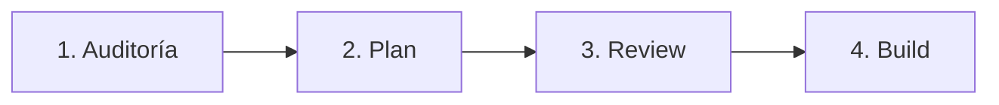

# Ciclo de Vida del Desarrollo con IA

InsureHero define un flujo de cuatro fases para todo desarrollo asistido por agentes. Saltarse una fase introduce riesgo y deuda técnica.

## Las 4 fases

### 1. Auditoría
**Análisis del codebase actual contra las reglas de gobernanza.**
El agente revisa la zona del código a modificar, identifica patrones existentes y valida que el cambio propuesto no viole reglas activas.

### 2. Plan
**Propuesta técnica en Modo Plan.**
El agente genera un plan detallado de qué archivos creará, qué modificará y por qué. **No genera código todavía**.

### 3. Review
**Validación humana de la arquitectura.**
El ingeniero revisa el plan, lo aprueba, lo modifica o lo rechaza. Esta es la fase de control senior — el humano decide si la solución propuesta es la correcta antes de invertir tokens en generarla.

### 4. Build
**Generación de código final estandarizado.**
Solo después de aprobar el plan, el agente genera el código siguiendo todas las reglas activas.

## Modo Plan: control senior

> _"Planificación > Ejecución"_

El **Modo Plan** es el estándar operativo en InsureHero. Permite que el ingeniero valide la lógica **antes** de inyectar código.

### Por qué es obligatorio

Esta metodología:
- **Previene alucinaciones** del agente al forzar verbalización del plan.
- **Asegura el uso de tipos correctos** porque el plan se discute antes de escribir código.
- **Garantiza que la IA respete la jerarquía de las 6 capas** antes de realizar cambios físicos.
- **Reduce iteraciones costosas** — es más barato corregir un plan que refactorizar código generado.

### Cuándo NO aplicar Modo Plan

Para tareas triviales (renombrar variables, añadir un comentario, ajustar un import) el Modo Plan es overkill. Aplica para:
- Crear nuevos endpoints
- Añadir tablas o migraciones
- Refactorizar lógica de negocio
- Integrar nuevos adaptadores
- Cualquier cambio que cruce capas A-F
