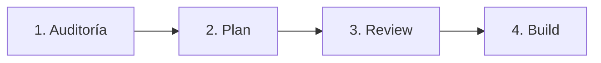

# Ciclo de Vida del Desarrollo con IA

InsureHero define un flujo de cuatro fases para todo desarrollo asistido por agentes. Saltarse una fase introduce riesgo y deuda técnica.

## Las 4 fases

```mermaid
flowchart LR
    A[1. Auditoría] --> B[2. Plan]
    B --> C[3. Review]
    C --> D[4. Build]
```

### 1. Auditoría
**Análisis del codebase actual contra las reglas de gobernanza.**
El agente revisa la zona del código a modificar, identifica patrones existentes y valida que el cambio propuesto no viole reglas activas.

### 2. Plan
**Propuesta técnica en Modo Plan.**
El agente genera un plan detallado de qué archivos creará, qué modificará y por qué. **No genera código todavía**.

### 3. Review
**Validación humana de la arquitectura.**
El ingeniero revisa el plan, lo aprueba, lo modifica o lo rechaza. Esta es la fase de control senior — el humano decide si la solución propuesta es la correcta antes de invertir tokens en generarla.

### 4. Build
**Generación de código final estandarizado.**
Solo después de aprobar el plan, el agente genera el código siguiendo todas las reglas activas.

## Modo Plan: control senior

> _"Planificación > Ejecución"_

El **Modo Plan** es el estándar operativo en InsureHero. Permite que el ingeniero valide la lógica **antes** de inyectar código.

### Por qué es obligatorio

Esta metodología:
- **Previene alucinaciones** del agente al forzar verbalización del plan.
- **Asegura el uso de tipos correctos** porque el plan se discute antes de escribir código.
- **Garantiza que la IA respete la jerarquía de las 6 capas** antes de realizar cambios físicos.
- **Reduce iteraciones costosas** — es más barato corregir un plan que refactorizar código generado.

### Cuándo NO aplicar Modo Plan

Para tareas triviales (renombrar variables, añadir un comentario, ajustar un import) el Modo Plan es overkill. Aplica para:
- Crear nuevos endpoints
- Añadir tablas o migraciones
- Refactorizar lógica de negocio
- Integrar nuevos adaptadores
- Cualquier cambio que cruce capas A-F

## Sincronización automática del handbook

Cada feature parte de un **spec SDD** que se commitea junto con la implementación en `apps/next/specs/SCRUM-XXX-*.md`. Cuando ese spec llega a `develop` (al mergear la rama de feature) ya refleja fielmente lo que se implementó, por lo que sirve de señal de **qué documentar** sin tener que analizar el diff completo de código.

A partir de esa señal, el handbook se mantiene al día de forma automática mediante un workflow de GitHub Actions (`handbook-sync.yml`) en el monorepo `insureHero`:

1. **Disparo** — un `push` a `develop` que agregue o modifique un `apps/next/specs/SCRUM-NNN-*.md` dispara el workflow. También puede lanzarse manualmente (`workflow_dispatch`). Se ignoran plantilla, `README` y adjuntos que no sean `.md`.
2. **Detección** — el workflow calcula el diff entre el estado anterior y el nuevo del push y arma la lista de specs nuevos o modificados de esa corrida.
3. **Actualización** — invoca a Claude Code en modo headless con esa lista. El agente sigue la **regla de oro** del `CLAUDE.md` del handbook: _el spec describe un cambio, el handbook describe el estado actual_. Lee el spec y el código real, y edita únicamente la sección de docs correspondiente, sin copiar el spec.
4. **Entrega** — si el agente generó cambios reales, se abre un **Pull Request contra `main`** del handbook (nunca push directo). Si no hay nada que actualizar porque la doc ya refleja el estado actual, no se abre PR.

> 📌 **PR-only, siempre con revisión humana.** El build de Docusaurus corre con `onBrokenLinks: 'throw'`, así que un doc mal generado no debe poder llegar a `main` sin revisión. El PR generado se revisa y mergea igual que cualquier otro.

> 💡 El mecanismo **depende de la convención SDD**: cubre lo que pasa por un spec commiteado, no la reemplaza. Hotfixes o ediciones directas sin spec siguen requiriendo actualizar la doc a mano.
