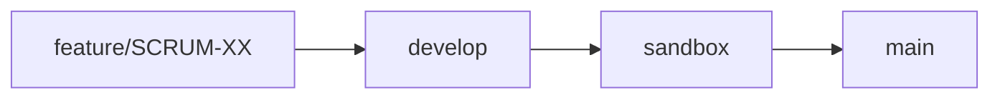
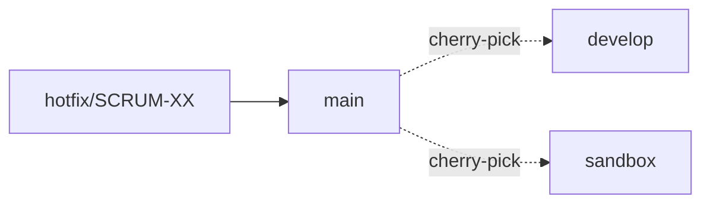

# Ambientes y Flujo de Promoción

InsureHero opera con **tres ambientes**, cada uno con su propia rama Git, su propio proyecto Supabase y su propio dominio Vercel.

## Los 3 ambientes

| Ambiente | Rama | Dominio | Supabase | Propósito |
|----------|------|---------|----------|-----------|
| **Desarrollo** | `develop` | `develop.insurehero.io` | `InsureHero - DEV` | Trabajo activo del equipo |
| **Sandbox** | `sandbox` | `sandbox.insurehero.io` | `InsureHero - Sandbox` | Pre-producción y pruebas de partners |
| **Producción** | `main` | `app.insurehero.io` | `InsureHero` | Producción real |

> 📌 **Sandbox no es QA interno.** Los partners de integración lo usan para sus propias pruebas, por lo que debe mantenerse estable y con datos representativos (aunque sintéticos).

## Flujo de promoción



### Paso a paso

1. **Rama de feature** sale de `develop` — ver [Convenciones de Ramas](./ramas).
2. **PR a `develop`** — código revisado, tests pasan, merge.
3. **Promoción a `sandbox`** — merge de `develop` → `sandbox` cuando la feature está lista para pruebas de partners.
4. **Promoción a `main`** — merge de `sandbox` → `main` cuando está validado en sandbox y aprobado para producción.

### Hotfix (flujo excepcional)

Un bug crítico en producción no puede esperar el ciclo normal:



1. Rama `hotfix/SCRUM-XXX` sale directamente de `main`.
2. PR contra `main`, review urgente, merge y deploy.
3. **Obligatorio:** cherry-pick del commit del hotfix a `develop` y `sandbox` para mantener las 3 ramas sincronizadas.

## Mapa de configuración por ambiente

### Variables de entorno críticas

Cada ambiente tiene su propio set de variables configurado en Vercel:

| Variable | Develop | Sandbox | Producción |
|----------|---------|---------|------------|
| `SUPABASE_URL` | Proyecto DEV | Proyecto Sandbox | Proyecto Main |
| `SUPABASE_SERVICE_ROLE_KEY` | Key de DEV | Key de Sandbox | Key de Main |
| `AUTH_SECRET` | Dev-only secret | Sandbox secret | Prod secret |
| `QSTASH_TOKEN` | Dev token | Sandbox token | Prod token |

### Supabase

Los 3 proyectos de Supabase son independientes. Los cambios de esquema se aplican **siempre primero en desarrollo**:

```bash
# Apuntar el CLI a develop
supabase db push --project-ref

# Luego sandbox
supabase db push --project-ref

# Finalmente main
supabase db push --project-ref
```

> ⚠️ **Nunca aplicar migraciones directamente en producción.** Siempre pasar primero por develop → sandbox → main.

### Vercel

Vercel detecta pushes a cada rama y construye automáticamente:

- Push a `develop` → deploy automático a `develop.insurehero.io`
- Push a `sandbox` → deploy automático a `sandbox.insurehero.io`
- Push a `main` → deploy automático a `app.insurehero.io`

Los PRs contra cualquiera de las 3 ramas generan también **preview deployments** con URL temporal.

## Qué NO hacer

❌ **Commitear directamente a `main`, `sandbox` o `develop`.**
Siempre pasar por PR. El repositorio tiene branch protection activa.

❌ **Saltarse ambientes.**
Un feature no va directo de `develop` a `main` — tiene que pasar por `sandbox` primero, sin excepción (salvo hotfixes).

❌ **Probar en producción.**
Si necesitas probar con datos reales, coordina con el equipo para replicar el caso en `sandbox`.

❌ **Mezclar credenciales entre ambientes.**
Los tokens, secrets y API keys de producción nunca deben usarse fuera de `main`.
