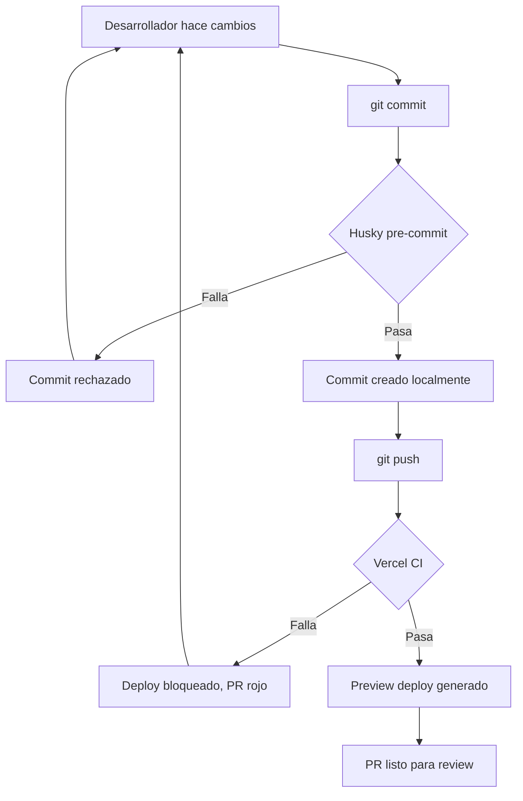

# Pre-commit Hooks y CI

InsureHero valida la calidad del código en **dos capas**: localmente antes de cada commit (Husky) y en Vercel durante cada build (CI).

## Capa 1: Pre-commit hook local (Husky)

Antes de crear cualquier commit, Husky ejecuta un pipeline que bloquea el commit si falla cualquier check.

### Pipeline de Husky

```bash
turbo run check-types → turbo run lint → turbo run check-format → turbo run test:ci
```

### Qué valida cada paso

| Paso | Herramienta | Qué verifica |
|------|-------------|--------------|
| `check-types` | TypeScript `tsc --noEmit` | 0 errores de tipos en todo el monorepo |
| `lint` | ESLint | 0 errores de lint (warnings permitidos) |
| `check-format` | Prettier | Todos los archivos siguen el formato estándar |
| `test:ci` | Vitest + Jest | Todos los tests pasan (399 Vitest + 29 Jest del landing) |

### Configuración

El hook vive en `.husky/pre-commit` y se ejecuta vía **Turborepo**, que paraleliza y cachea los checks por paquete. Si un paquete no cambió, sus checks se saltan gracias al cache.

### Cuando el commit es rechazado

Husky imprime el error específico y aborta. El flujo típico:

1. Lees el error (normalmente es claro).
2. Lo arreglas.
3. `git add` los cambios.
4. Reintentas el commit.

### Bypass de emergencia (no recomendado)

En casos excepcionales (commits de WIP en rama personal, debugging) se puede saltar el hook:

```bash
git commit --no-verify -m "wip: debugging phoenix auth"
```

> ⚠️ **Nunca usar `--no-verify` en ramas que vayan a PR.** El hook existe justamente para que el código que llega a `develop`, `sandbox` o `main` pase todos los checks.

## Capa 2: CI en Vercel

Cada push a GitHub dispara un build en Vercel. El pipeline de Vercel es más completo que el local:

### Pipeline de Vercel

```bash
yarn install → yarn postinstall (compile) → yarn build → turbo run build
```

### Orden de compilación

Turborepo orquesta las dependencias según `turbo.json`:

1. **Paquetes compartidos primero:**
   - `@insureHero/types`
   - `@insureHero/utils`
   - `@insureHero/builders`
2. **App Next.js después** (`apps/next`) — consume los paquetes ya compilados.

Si el build falla en cualquier paso, Vercel **bloquea el deploy** y marca el PR con estado rojo.

### Funciones serverless con timeout extendido

Algunas rutas necesitan más de los ~15s default de Vercel Pro. Configurado en `apps/next/vercel.json`:

```json
{
  "functions": {
    "src/app/api/integrations/dispatch/route.ts": { "maxDuration": 60 },
    "src/app/api/integrations/retry/route.ts": { "maxDuration": 60 }
  }
}
```

Estas dos rutas tienen **60 segundos** porque llaman a adapters externos (Phoenix, AMA) que pueden tardar.

## Comandos útiles

### Correr el pipeline manualmente antes de commitear

Útil para verificar que todo va a pasar antes de ejecutar el commit:

```bash
yarn check-types
yarn lint
yarn check-format
yarn test:ci
```

O todos en uno:

```bash
yarn validate
```

### Autoformatear código

```bash
yarn format
```

Aplica Prettier sobre todo el código. Correr antes de commitear para evitar que `check-format` falle.

### Regenerar tipos de Supabase

Cuando cambias el esquema de BD:

```bash
supabase gen types typescript --project-id  > packages/types/src/types/generated-database.types.ts
```

Estos tipos alimentan `check-types` — si no se regeneran tras un cambio de esquema, el build local falla.

## Diagrama de flujo



## Resumen: dos redes de seguridad

| Capa | Dónde corre | Qué captura |
|------|-------------|-------------|
| **Husky (local)** | Tu máquina, antes del commit | Errores de tipos, lint, formato, tests |
| **Vercel (CI)** | Build en Vercel, tras el push | Lo mismo + build real + deploy de preview |

Ambas son obligatorias. La local es rápida y evita commits rotos. La de CI es la verdad absoluta del estado del código desplegable.
